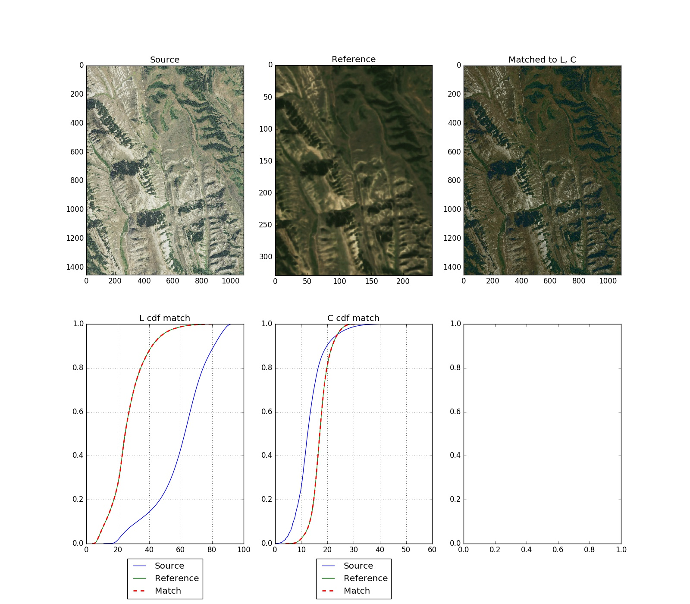

[](https://travis-ci.org/mapbox/rio-hist)
[](https://coveralls.io/github/mapbox/rio-hist?branch=master)

# rio-hist

Histogram matching plugin for rasterio.

Provides a CLI and python module for adjusting colors based on histogram matching in a variety of colorspaces.

## Example

We have a *source* image that we want to alter.
We have a *reference* image with a histogram that we like.
The goal is to adjust the values of the source image so that its histogram matches that of the reference.

The matching directly in the default RGB colorspace does not always give the best results. So for this example, we'll adjust based on the Lightness and Chroma in LCH colorspace.

```
$ rio hist -c LCH -b 1,2 --plot source.tif reference.tif output.tif
```

This will give us a new `output.tif` that matches the histogram of reference. And the `--plot` option
also allows us to see some diagnostic plots to inspect the results and the cumulative distribution functions of the matching process.




## CLI docs

```
$ rio hist --help
Usage: rio hist [OPTIONS] SRC_PATH REF_PATH DST_PATH

  Color correction by histogram matching

Options:
  -c, --color-space [RGB|LCH|LAB|Lab|LUV|XYZ]
                                  Colorspace
  -b, --bands TEXT                comma-separated list of bands to match
                                  (default 1,2,3)
  -m, --match-proportion FLOAT    Interpolate values between source and
                                  reference histogram. 1.0 (default) is full
                                  match, 0.0 is no match
  --plot                          create a <basename>_plot.png with diagnostic
                                  plots
  -v, --verbose
  --co NAME=VALUE                 Driver specific creation options.See the
                                  documentation for the selected output driver
                                  for more information.
  --help                          Show this message and exit.
```

## Python docs

`rio_hist.match.histogram_match` is the main entry point and operates on a single band.

`rio_hist.utils` has some interesting functions that may be useful in other contexts.
